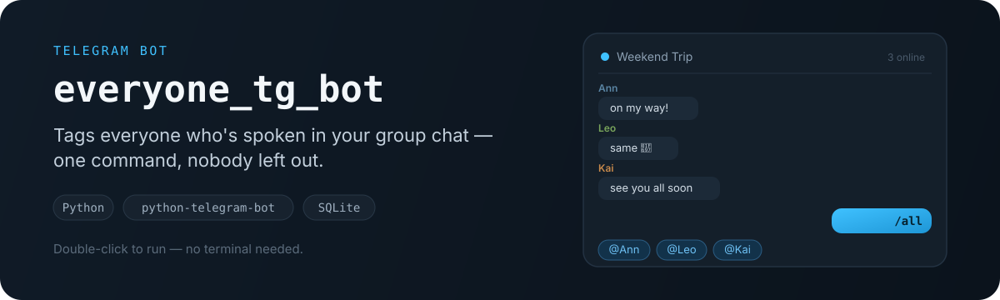

<p align="center">
  
</p>

<p align="center">
  <a href="#setup-easy-way--no-terminal-needed">Setup</a> ·
  <a href="#setup-manual-way-if-you-prefer-a-terminal">Manual setup</a> ·
  <a href="#notes">Notes</a>
</p>

## How it works

Telegram doesn't let bots fetch a group's full member list — that's a privacy
restriction. So instead, this bot quietly remembers everyone who sends a
message while it's running. Send `/all`, and it mentions everyone it's seen
so far, chunked into a few messages so Telegram doesn't choke on one giant
wall of tags.

The seen-user list is stored in a local SQLite file (`bot.db`, created
automatically) so it survives restarts.

## Setup (easy way — no terminal needed)

1. **Create a bot token**
   - Message [@BotFather](https://t.me/BotFather) on Telegram
   - Send `/newbot` and follow the prompts
   - Copy the token it gives you

2. **Double-click the starter script for your OS**
   - Windows: `start.bat`
   - macOS: `start.command`
     (first time only, macOS may warn it's from an unidentified developer —
     right-click it and choose **Open** to allow it once)

   The first run installs everything automatically and asks you to paste your
   bot token — it saves it into `.env` so you only enter it once. It then
   starts the bot. Every time after that, just double-click the same file to
   start the bot again.

3. **Add it to your group**
   - Add the bot to your group chat
   - Make it an **admin** (any permissions, even none, are fine) — this is
     required so Telegram lets it see all messages instead of only commands

That's it. Let people chat normally, then send `/all` to tag everyone the bot
has seen so far. Close the window to stop the bot.

## Setup (manual way, if you prefer a terminal)

```bash
pip install -r requirements.txt
cp .env.example .env    # then paste your token into .env as BOT_TOKEN=...
python bot.py
```

## Notes

- Only tags people who've sent at least one message since the bot first joined.
- Seen-users data persists across restarts in `bot.db` (not committed to git).
- Keep `bot.py` running continuously (on your machine, a spare PC, or a server)
  for it to keep tracking messages — Telegram doesn't host bot code for you.
